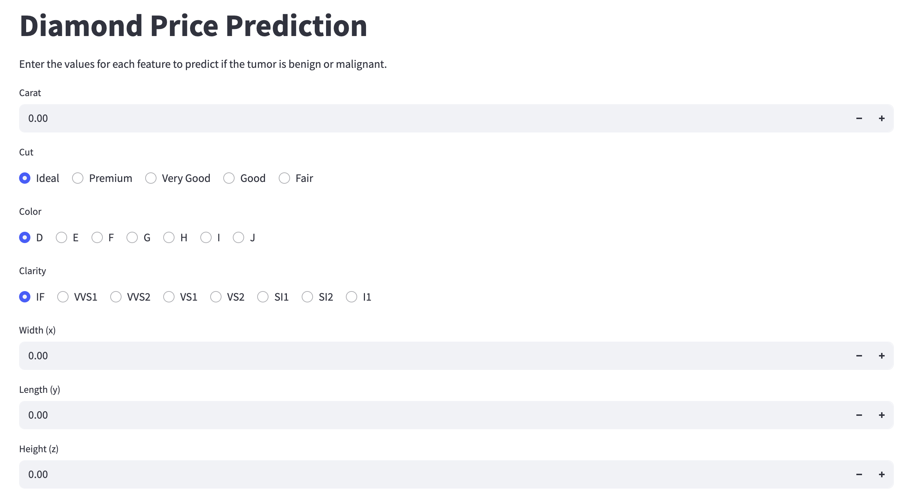

# 💎 Diamond Price Prediction - Machine Learning Project

This project uses supervised learning techniques to predict diamond prices based on key features like carat, cut, color, clarity, and dimensions. The solution demonstrates an end-to-end ML workflow including data preprocessing, model training, API deployment using FastAPI, and a frontend interface using Streamlit.

---

## 📌 Project Highlights

- **Dataset**: Contains features like carat, cut, color, clarity, depth, table, dimensions (`x`, `y`, `z`), and price.
- **Model Used**: XGBoost Regressor with hyperparameter tuning.
- **Performance Metric**: Root Mean Squared Error (RMSE) and R² score.
- **Deployment**:
  - **Backend**: FastAPI REST endpoint.
  - **Frontend**: Streamlit web interface for user-friendly interaction.
- **Version Control**: Codebase and model tracked using Git.
- **Reproducibility**: All dependencies are maintained via `requirements.txt`.

---

## ✅ Learnings from the Project

- Improved understanding of **feature importance** in regression models.
- Learned practical use of **pipelines and transformers** in `scikit-learn`.
- Performed **hyperparameter tuning using Optuna** to improve model accuracy and efficiency.
- Built **interactive visualizations using Plotly** to enhance data understanding and user experience.
- Gained experience with **FastAPI** for deploying ML models as APIs.
- Implemented a clean and interactive **Streamlit interface**.
- Understood the need for **data scaling** and **categorical encoding**.

---

## ⚠️ Areas Where the Project Fell Short

- The Streamlit app has **limited error handling** for invalid user inputs.
- No integration yet with cloud-based APIs for real-time deployment.

---

## 🚀 How to Run the Project

### 1. Clone the Repository

```bash
git clone https://github.com/yourusername/diamond-price-prediction.git
cd diamond-price-prediction
```

### 2. Install Dependencies

```bash
pip install -r requirements.txt
```

### 3. Run the FastAPI Backend

```bash
uvicorn api:app --reload
```

This will start the API at http://127.0.0.1:8000.

You can test the API at: http://127.0.0.1:8000/docs

### 4. Run the Streamlit Frontend

```
streamlit run webapp/app.py
```

This will launch the app in your default browser.

---

## 🧪 Sample Screenshots

### 📊 Streamlit Interface



### 🔍 FastAPI Docs UI


---

## 👨‍💻 Author

**Reema Raghava**
Aspiring Data Scientist | 20+ years in Software Engineering
📧 reema14a@gmail.com
🔗 [LinkedIn](https://www.linkedin.com/in/reema-raghava-pmp%C2%AE-28737a11/)
